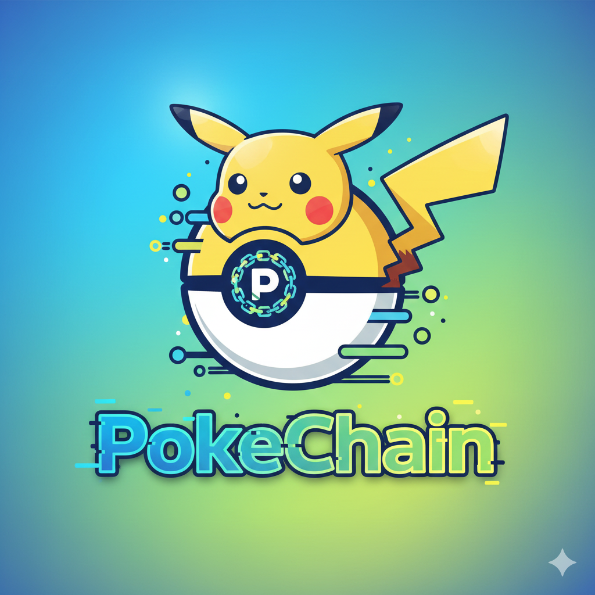
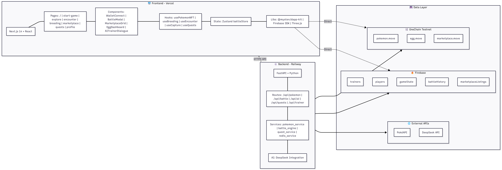

<p align="center">
  
</p>

<h1 align="center">🎮 PokeChain</h1>

<p align="center">
  <strong>A Web3 Pokemon Game on OneChain Blockchain</strong>
</p>

<p align="center">
  
  
  
  
</p>

<p align="center">
  <a href="#-live-demo">Live Demo</a> •
  <a href="#-key-features">Features</a> •
  <a href="#-system-architecture">Architecture</a> •
  <a href="#-getting-started">Getting Started</a>
</p>

---

## 📖 Project Overview

**PokeChain** is a fully decentralized Pokemon-style game built on the **OneChain blockchain** (Sui-compatible). Players can collect, battle, breed, and trade Pokemon NFTs in an immersive 3D island world. All game assets are stored on-chain as NFTs, ensuring true ownership and transparency.

Experience the nostalgia of Pokemon with the power of Web3 technology!

---

## 🎬 Live Demo

| Platform | Link |
|----------|------|
| 🎥 **YouTube Demo** | [Watch Demo Video](https://youtu.be/4_Y_t3AGn2A?si=n15cwaNL8u2mpTQc) |
| 🌐 **Live Web App** | [Play PokeChain](https://pokemon-game-fi.vercel.app/) |

---

## ✨ Key Features

### 🏝️ 3D Island Exploration
- Explore a beautiful 3D floating island with multiple locations
- Real-time multiplayer - see other players exploring the world
- Interactive buildings: Battle Tower, Breeding Center, Marketplace, Profile House
- Encounter wild Pokemon roaming the island

### ⚔️ Battle System
- Turn-based Pokemon battles with type advantages
- Multiple moves with different power and accuracy
- Experience points (EXP) system with level-up mechanics
- Pokemon evolution at certain levels
- Battle animations and visual effects

### 🥚 Breeding System
- Breed two Pokemon to create eggs
- Egg incubation with step counter (battles add steps!)
- Hatch eggs to discover new Pokemon with inherited traits
- Rare Pokemon breeding possibilities

### 🏪 NFT Marketplace
- List your Pokemon NFTs for sale
- Browse and purchase Pokemon from other trainers
- Secure on-chain transactions with OCT (OneChain Token)
- Filter by type, level, and price
- 2.5% marketplace fee

### 👤 Profile & Collection
- View your complete Pokemon collection
- Track Pokemon stats, level, and experience
- Evolve pokemon in 12 level and 20 level
- Character customization (6 unique characters)
- Battle history and achievements

### 🤖 AI Trainer Dialogue
- Chat with AI-powered Pokemon trainers
- Get tips and strategies
- Immersive storytelling experience
- Powered by Deepseek AI

### 📜 Quest System
- Daily and weekly quests
- Earn rewards for completing challenges
- Track progress and achievements

### 🎵 Immersive Audio
- Background music for different areas
- Battle sound effects
- Toggle music on/off

---

## 🏗️ System Architecture

### High-Level Overview

<p align="center">
  
</p>

### Architecture Components

```
┌─────────────────────────────────────────────────────────────────┐
│                        FRONTEND (Next.js)                       │
│  ┌─────────────┐  ┌─────────────┐  ┌─────────────┐              │
│  │   3D Scene  │  │   Battle    │  │  Breeding   │              │
│  │  (Three.js) │  │   System    │  │   System    │              │
│  └─────────────┘  └─────────────┘  └─────────────┘              │
│  ┌─────────────┐  ┌─────────────┐  ┌─────────────┐              │
│  │ Marketplace │  │   Profile   │  │   Quests    │              │
│  └─────────────┘  └─────────────┘  └─────────────┘              │
└────────────────────────────┬────────────────────────────────────┘
                             │
         ┌───────────────────┼───────────────────┐
         │                   │                   │
         ▼                   ▼                   ▼
┌─────────────────┐  ┌─────────────────┐  ┌─────────────────┐
│OneChain         │  │    Firebase     │  │  Backend API    │
│   Blockchain    │  │                 │  │                 │
│   (Move Smart   │  │   (Firestore    │  │   (Python       │
│    Contracts)   │  │    Database)    │  │    FastAPI)     │
└─────────────────┘  └─────────────────┘  └─────────────────┘
        │                    │                    │
        │                    │                    │
        ▼                    ▼                    ▼
   Pokemon NFTs         Multiplayer          AI Dialogue
   Marketplace          Position Sync        Quest System
   Breeding/Eggs        Profile              Battle Engine
```

---

## 🛠️ Technology Stack

### Frontend
| Technology | Purpose |
|------------|---------|
| **Next.js 15** | React framework with App Router |
| **TypeScript** | Type-safe development |
| **Three.js / React Three Fiber** | 3D graphics and island rendering |
| **Tailwind CSS** | Styling and responsive design |
| **@mysten/dapp-kit** | Sui wallet integration |
| **Zustand** | State management |
| **Sonner** | Toast notifications |

### Backend
| Technology | Purpose |
|------------|---------|
| **Python FastAPI** | REST API server |
| **Deepseek** | AI trainer dialogue |
| **Firebase Firestore** | Real-time multiplayer sync |

### Blockchain
| Technology | Purpose |
|------------|---------|
| **OneChain Testnet** | Sui-compatible Layer 1 blockchain |
| **Move Language** | Smart contract development |
| **OneChain Wallet** | Wallet connection (Sui Wallet, Suiet, etc.) |
| **OCT Token** | Native gas and marketplace currency |

### Development Tools
| Tool | Purpose |
|------|---------|
| **Kiro IDE** | AI-powered development environment |
| **Vercel** | Frontend deployment |
| **Railway** | Backend deployment |

---

## 🔗 Important Endpoints

### Frontend Routes
| Route | Description |
|-------|-------------|
| `/` | Landing page |
| `/start-game` | Character selection & game start |
| `/explore` | Main 3D island exploration |
| `/battle` | Pokemon battle arena |
| `/breeding` | Breeding center & egg incubation |
| `/marketplace` | NFT marketplace |
| `/profile` | Player profile & collection |
| `/quests` | Quest board |
| `/trainer-dialogue` | AI trainer chat |

### Backend API
| Endpoint | Method | Description |
|----------|--------|-------------|
| `/api/trainer/dialogue` | POST | AI trainer conversation |
| `/api/quest/daily` | GET | Get daily quests |
| `/api/quest/complete` | POST | Complete a quest |
| `/api/pokemon/stats` | GET | Get Pokemon statistics |

### Smart Contract Functions
| Function | Description |
|----------|-------------|
| `mint_pokemon` | Mint a new Pokemon NFT |
| `add_experience` | Add EXP to Pokemon |
| `evolve_pokemon` | Evolve Pokemon to next form |
| `create_egg` | Create breeding egg |
| `hatch_egg` | Hatch egg into Pokemon |
| `list_for_sale` | List Pokemon on marketplace |
| `purchase` | Buy Pokemon from marketplace |

---

## 🚀 Future Implementation

### 💬 Revolutionary Social Features
- **Real-time Global Chat** - Chat with trainers worldwide with instant translation
- **Pokemon Trading Hub** - Secure P2P trading with escrow smart contracts
- **Live PvP Battles** - Real-time competitive battles with ranking system
- **Voice Chat Integration** - Talk to your battle opponents live
- **Friend System** - Add friends, see their online status, and challenge them anytime

### 🗺️ Massive World Expansion
- **10+ Unique Islands** - Each with different biomes, Pokemon, and challenges
  - 🌋 Volcano Island - Fire-type Pokemon paradise
  - ❄️ Frozen Tundra - Rare Ice-type Pokemon
  - 🌊 Underwater City - Dive for Water-type legends
  - 👻 Haunted Mansion - Ghost-type mysteries
  - ⚡ Electric Factory - Industrial zone with Electric types
- **Legendary Dungeons** - Raid-style dungeons for legendary Pokemon
- **8 Gym Leaders** - Challenge gyms to earn badges and unlock Elite Four
- **Pokemon League** - Become the Champion!

### 🎮 Next-Level Gameplay
- **500+ Pokemon Species** - Complete Pokedex from all generations
- **Mega Evolution** - Transform your Pokemon into powerful Mega forms
- **Z-Moves & Dynamax** - Ultimate battle mechanics
- **Held Items & Abilities** - Deep strategic gameplay
- **Shiny Pokemon** - 1/4096 chance for rare shiny variants
- **Legendary Events** - Time-limited events to catch Mewtwo, Rayquaza, etc.

### 🏆 Competitive Scene
- **Global Tournaments** - Weekly/Monthly tournaments with SUI prizes
- **Ranked Ladder** - Climb from Bronze to Champion rank
- **Guilds & Clans** - Form teams, guild wars, shared resources
- **Leaderboards** - Top trainers displayed globally
- **Seasonal Rewards** - Exclusive NFTs for top performers

### 💰 Advanced Economy
- **Staking Rewards** - Stake your Pokemon NFTs for passive income
- **Breeding Marketplace** - Sell eggs with guaranteed rare traits
- **Rental System** - Rent powerful Pokemon for tournaments
- **DAO Governance** - Community votes on game updates
- **Cross-chain Bridge** - Trade Pokemon across different blockchains

### 🤖 AI & Innovation
- **AI Battle Coach** - Personal AI trainer to improve your skills
- **Procedural Pokemon** - AI-generated unique Pokemon variants
- **Smart Matchmaking** - AI-powered fair battle matching
- **Dynamic Events** - AI creates unique world events

### 📱 Platform Expansion
- **Mobile App** - iOS & Android native apps
- **VR Support** - Explore the Pokemon world in Virtual Reality
- **AR Mode** - Catch Pokemon in the real world
- **Console Ports** - Play on Nintendo Switch, PlayStation, Xbox

---

## 🏁 Getting Started

### Prerequisites

- **Node.js** v18+ 
- **Python** 3.9+
- **OneChain Wallet** browser extension
- **OCT tokens** from OneChain faucet (for gas fees)

### Installation

1. **Clone the repository**
```bash
git clone https://github.com/yourusername/pokechain.git
cd pokechain
```

2. **Install frontend dependencies**
```bash
cd frontend
npm install
```

3. **Install backend dependencies**
```bash
cd ../backend
pip install -r requirements.txt
```

4. **Set up environment variables**

Frontend (`frontend/.env.local`):
```env
NEXT_PUBLIC_SUI_NETWORK=onechain-testnet
NEXT_PUBLIC_RPC_URL=https://rpc-testnet.onelabs.cc:443
NEXT_PUBLIC_PACKAGE_ID=your_package_id
NEXT_PUBLIC_MARKETPLACE_ID=your_marketplace_id
NEXT_PUBLIC_GAME_STATE_ID=your_game_state_id
NEXT_PUBLIC_FIREBASE_API_KEY=your_firebase_key
```

Backend (`backend/.env`):
```env
DEEPSEEK_API_KEY=your_deepseek_api_key
DEEPSEEK_MODEL=deepseek-chat
GEMINI_API_KEY=your_gemini_api_key
FIREBASE_CREDENTIALS=your_firebase_credentials
```

5. **Run the development servers**

Frontend:
```bash
cd frontend
npm run dev
```

Backend:
```bash
cd backend
uvicorn main:app --reload
```

6. **Open in browser**
```
http://localhost:3000
```

### Wallet Setup

1. Install **Sui Wallet** browser extension
2. Create or import a wallet
3. Switch network to **OneChain Testnet**
   - RPC URL: `https://rpc-testnet.onelabs.cc:443`
4. Get OCT tokens from [OneChain Faucet](https://faucet.onechain.ai)
5. Connect wallet to PokeChain

### Smart Contract Deployment

Deploy to OneChain Testnet:
```bash
cd contracts/pokemon_nft
sui client publish --gas-budget 100000000
```

Update frontend `.env.local` with deployed contract addresses.

---

## 📁 Project Structure

```
pokechain/
├── frontend/                 # Next.js frontend
│   ├── app/                  # App router pages
│   ├── components/           # React components
│   │   └── scenes/           # 3D scene components
│   ├── hooks/                # Custom React hooks
│   ├── lib/                  # Utilities & configs
│   ├── public/               # Static assets
│   └── styles/               # CSS styles
├── backend/                  # Python FastAPI backend
│   ├── routes/               # API routes
│   ├── services/             # Business logic
│   └── config/               # Configuration
├── contracts/                # Move smart contracts
│   └── pokemon_nft/
│       └── sources/          # Move source files
└── README.md
```

---

## 👨‍💻 Author

<p align="center">
  <strong>Built with ❤️ by GOH SIN HUA</strong>
</p>

<p align="center">
  <a href="https://github.com/Sinhua0201">
    
  </a>
</p>

---

## 📄 License

This project is licensed under the MIT License - see the [LICENSE](LICENSE) file for details.

---

<p align="center">
  <strong>⭐ Star this repo if you like it! ⭐</strong>
</p>

<p align="center">
  
</p>
